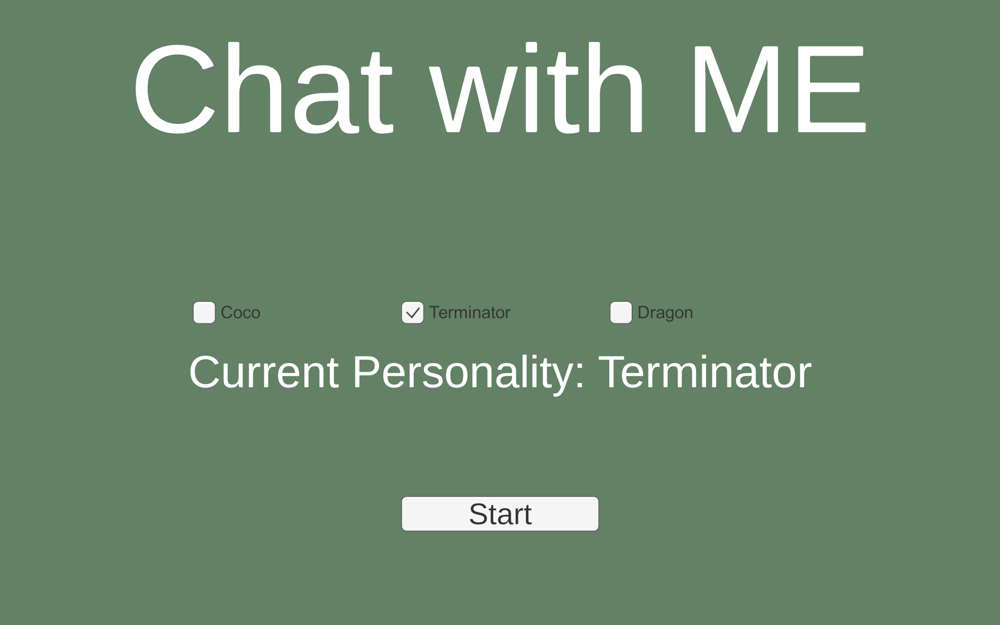
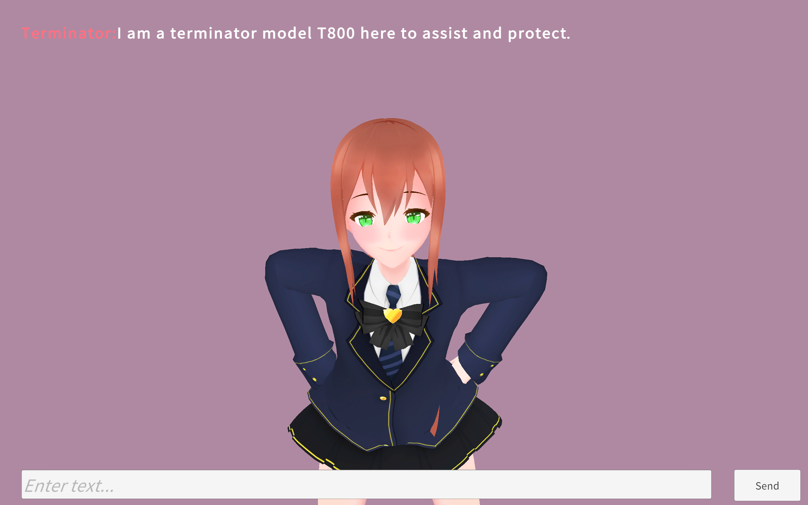

# Chatbot Simulator (Unity) — Local LLM NPC Dialogue

Chatbot Simulator is a Unity prototype game where NPC dialogue is generated at runtime from the player's text input. The NPC responds with **a line of dialogue**, an **animation cue** that drives the character's expression/gesture, **spoken audio** in a voice that matches the chosen personality, and **lip motion** synchronized to that audio in real time.

This project was originally built using an online ChatGPT API, and later adapted to run **locally** via **Ollama** so it can work without any cloud API keys. NPC speech is also generated locally — text-to-speech runs offline through **sherpa-onnx**, and lip sync is computed locally too via **uLipSync**, so the whole pipeline (LLM + voice + mouth) needs no internet at runtime.

## Demo screenshots







## What I built (mechanics / technical design)

- **Player → NPC conversation loop**
  - The player types a message in a UI input field.
  - The game sends the player message to an LLM conversation component.
  - The NPC reply is displayed in the UI and an animation is triggered on the NPC.

- **Structured model output (JSON)**
  - The model is prompted to return a single JSON object:
    - `reply_to_player`: the NPC’s line
    - `animation_name`: which animation/expression to play (e.g. `idle`, `confused`, `shy`, etc.)
  - Unity parses the JSON and uses it to update both text and animation.

- **Personality system**
  - NPC “personalities” are stored in a `ScriptableObject` database.
  - Each personality provides an initial prompt that sets the NPC’s style/role.
  - The menu scene lets the player choose a personality; the selection is saved with `PlayerPrefs`.

- **Local inference with Ollama (no API keys)**
  - The LLM backend is Ollama running on `http://localhost:11434`.
  - Default model: `qwen3:4b` (good balance of latency and reliable JSON formatting on many PCs).

- **Player-friendly fallback when local AI is unavailable**
  - On startup and on each request, the game checks whether Ollama is reachable.
  - If Ollama isn’t installed/running, the game returns a safe fallback JSON reply (with a `confused` animation) that tells the player how to start Ollama, so gameplay doesn’t freeze.

- **Per-character voices (offline TTS via sherpa-onnx)**
  - Each personality declares which voice it uses via a `ttsProfileName` field on its `PersonalityDB` entry. The field's value is the name of a TTS profile created in **Project Settings > Sherpa-ONNX > TTS**.
  - At scene start, `GameManager` switches the TTS engine to the selected personality's profile.
  - After each LLM reply, `GameManager` extracts `reply_to_player` from the JSON and routes it through a dedicated `AudioSource` so lip sync can analyze the stream as it plays.
  - Voices are [Piper](https://github.com/rhasspy/piper) models (small, CPU-friendly, fully offline). The current build maps Coco → `vits-piper-en_GB-cori-medium`, Terminator → `vits-piper-en_GB-alan-low`, Dragon → `vits-piper-en_GB-northern_english_male-medium`.

- **Real-time lip sync (offline via uLipSync)**
  - The NPC's mouth animates with the spoken audio frame-by-frame, using [uLipSync](https://github.com/hecomi/uLipSync)'s MFCC-based phoneme detection.
  - `NPCController.ApplyLipSyncDirect` listens to uLipSync's `On Lip Sync Update` event and drives the five mouth blendshapes (`MTH A/I/U/E/O` on the Latifa face mesh). The mapping is configured in the Inspector via a `Lip Sync Blend Shape Indices` array.
  - A `Lip Sync Mouth Intensity` slider controls how wide the mouth opens — easy to dial in per scene without changing code.
  - While speech is playing, conflicting facial blendshapes (the `ALL ...` whole-face emotion shapes and the `vrc.v_*` viseme shapes) are zeroed every frame so lip sync wins on the mouth. After speech ends, normal facial expression resumes.

## Project structure (high level)

- `Assets/Scripts/`
  - `GameManager.cs`: player input → send message → receive JSON → update UI, trigger NPC animation, and play the reply through the per-personality TTS voice.
  - `NPCController.cs`: animations, blendshape expressions, lip sync application, and mouth-conflict suppression during speech.
  - `PersonalityDB.cs`: personality definitions (ScriptableObject) — each entry has a name, an initial prompt, and a `ttsProfileName` pointing at a Sherpa-ONNX TTS profile.
- `Assets/Samples/uLipSync/`
  - Profile asset imported from the uLipSync Package Manager samples, used by the `uLipSync` analyzer to classify phonemes.
- `Assets/ChatGPT/`
  - `ChatGPTConversation.cs`: conversation state and HTTP calls to the LLM backend (adapted to Ollama).
- `Assets/StreamingAssets/SherpaOnnx/`
  - `tts-settings.json`: TTS profile list + cache config (managed by the editor importer).
  - `tts-models/<profileName>/`: one folder per Piper voice (model `.onnx`, `tokens.txt`, `espeak-ng-data/`). Populated by the importer.
- `Assets/Plugins/SherpaOnnx/`
  - Native sherpa-onnx libraries installed by **Project Settings > Sherpa-ONNX**. Not checked in.

## How to run (Build / downloaded release)

To run the built game on a Windows PC:

1. Install Ollama (once).
2. Download the model (once): `ollama pull qwen3:4b`
3. Before launching the game, start Ollama:

```powershell
ollama serve
```

4. Run the game `.exe`.

If Ollama is not running, the NPC will show a fallback message explaining how to start it. TTS voices are bundled inside the build under `StreamingAssets/SherpaOnnx/`, so no extra setup is needed on the player's machine.

## How to set up TTS (Editor / building from source)

Native sherpa-onnx libraries and voice models are **not** committed to the repo (they total hundreds of MB). After cloning, do this once:

1. Open **Edit > Project Settings > Sherpa-ONNX**.
2. Set the **Version** field to a sherpa-onnx version that exists on nuget.org (e.g. `1.13.2`). The package's hard-coded default may point at a version that has since been pruned, which produces a 404 on install.
3. Click **Install** on the **Managed .dll** row, then on **Windows > win-x64** (and any other platforms you target).
4. Open **Project Settings > Sherpa-ONNX > TTS**. For each of the three voices, click **Import from URL** and paste:
   - `https://github.com/k2-fsa/sherpa-onnx/releases/download/tts-models/vits-piper-en_GB-alan-low.tar.bz2`
   - `https://github.com/k2-fsa/sherpa-onnx/releases/download/tts-models/vits-piper-en_GB-cori-medium.tar.bz2`
   - `https://github.com/k2-fsa/sherpa-onnx/releases/download/tts-models/vits-piper-en_GB-northern_english_male-medium.tar.bz2`
5. Confirm each `PersonalityDB` entry's `ttsProfileName` field matches the profile name created by the importer (see the mapping above).
6. In the gameplay scene, the GameObject holding `GameManager` should also have a `TtsOrchestrator` component, and the `TtsOrchestrator` reference on `GameManager` must be assigned.

## How to set up Lip Sync (Editor / building from source)

The uLipSync package is added through the standard Unity Package Manager flow, but it ships its phoneme calibration profile as a sample that has to be imported manually:

1. Open **Window > Package Manager**, select **uLipSync**, expand **Samples**, and click **Import** next to **00. Common**. This drops `uLipSync-Profile-UnityChan.asset` into `Assets/Samples/uLipSync/`.
2. As a child of the NPC GameObject, create an empty GameObject named `Voice`. Add an **AudioSource** (uncheck *Play On Awake*) and a **uLipSync** component. Drag the imported profile into the uLipSync component's **Profile** slot.
3. Wire the `Voice` GameObject's AudioSource into `GameManager`'s **Tts Audio Source** field — TTS output plays through here so uLipSync can hear it via `OnAudioFilterRead`.
4. On the NPC root with `NPCController`, assign:
   - **Lip Sync Source** → the uLipSync component on the `Voice` GameObject.
   - **Lip Sync Blend Shape Indices** → exactly 5 entries, in this order, pointing at the face mesh's mouth blendshapes: `MTH A`, `MTH I`, `MTH U`, `MTH E`, `MTH O`. To find the correct indices for your model, right-click the `NPCController` component header and pick **"Log Blend Shapes"** — it dumps every blendshape name + index to the Console.
   - **Lip Sync Mouth Intensity** → tune to taste (default 200; 100 = subtle, 300 = exaggerated).
5. On the `Voice` GameObject's uLipSync component, find the **On Lip Sync Update (LipSyncInfo)** UnityEvent. Click **+**, drag the NPC root into the object slot, and select **NPCController → ApplyLipSyncDirect** as the target method.

## Notes / troubleshooting

- **If the NPC keeps saying “Thinking…”**
  - Ensure `ollama serve` is running and that `http://localhost:11434` is reachable.
- **Model name**
  - If your Ollama model is listed with a different name/tag, update the model string in `Assets/ChatGPT/ChatGPTConversation.cs`.
- **Sherpa-ONNX "Install" button fails with HTTP 404**
  - The version configured in **Project Settings > Sherpa-ONNX** does not exist on nuget.org. Open `https://www.nuget.org/packages/org.k2fsa.sherpa.onnx` to find a current version and update the **Version** field accordingly.
- **Sherpa-ONNX "Install" hangs at 0% with no error**
  - The download is to `www.nuget.org`. If your network can't reach it, try a VPN or download the `.nupkg` files manually (they're zips). Extract `lib/netstandard2.0/sherpa-onnx.dll` into `Assets/Plugins/SherpaOnnx/`, and the contents of `runtimes/win-x64/native/` into `Assets/Plugins/SherpaOnnx/win-x64/`.
- **NPC text appears but is silent**
  - Confirm a `TtsOrchestrator` is in the scene and wired to `GameManager`'s `Tts` slot.
  - Confirm the personality's `ttsProfileName` matches a profile listed in **Project Settings > Sherpa-ONNX > TTS** (case-sensitive, exact).
  - Check the Console for `[SherpaOnnx]` errors — missing `tokens.txt` or `espeak-ng-data/` usually means a partial import; use the importer to redownload that voice.
- **NPC voice plays but the mouth doesn't move**
  - Confirm `ApplyLipSyncDirect` is wired as a listener on the uLipSync component's **On Lip Sync Update** event.
  - Use the **Log Blend Shapes** context-menu action on `NPCController` and check that the indices in **Lip Sync Blend Shape Indices** actually correspond to `MTH A/I/U/E/O` on the face mesh.
  - During Play, watch those blendshape weights live in the Body's SkinnedMeshRenderer inspector — they should pulse between 0 and a high value as the NPC speaks.
- **Mouth moves but the face stays locked in a smile/frown during speech**
  - Confirm **Lip Sync Source** on `NPCController` points at the uLipSync analyzer component (not the AudioSource).
  - Raise **Lip Sync Mouth Intensity** if the motion is too subtle to see under the emotion expression.

## Credits

- Built in Unity by a student as a prototype exploring NPC dialogue driven by LLMs.
- Local LLM backend powered by Ollama.
- Offline TTS powered by [sherpa-onnx](https://github.com/k2-fsa/sherpa-onnx) with Piper voices.
- Real-time lip sync powered by [uLipSync](https://github.com/hecomi/uLipSync).

