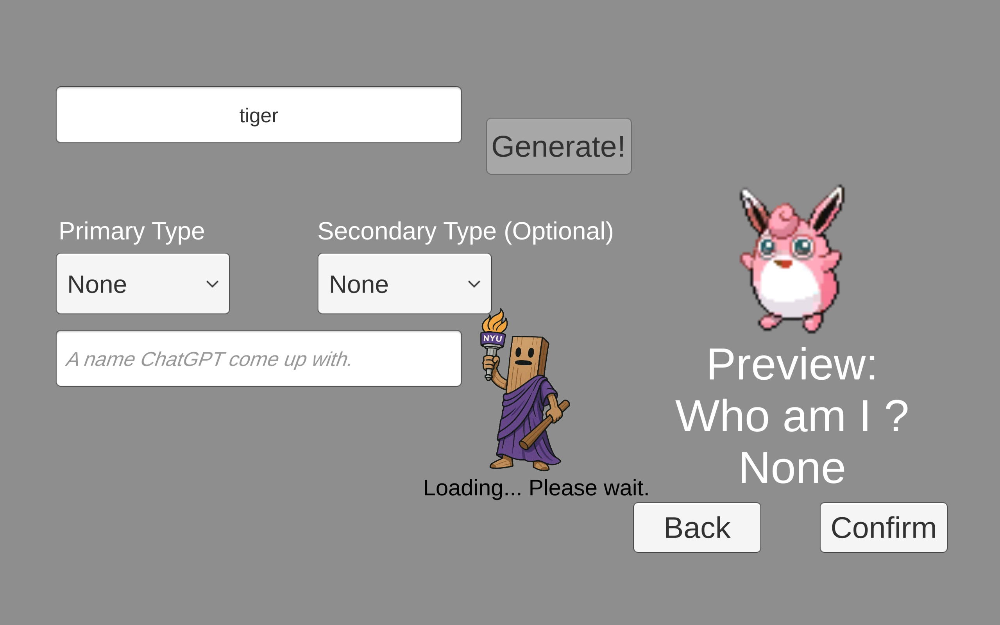
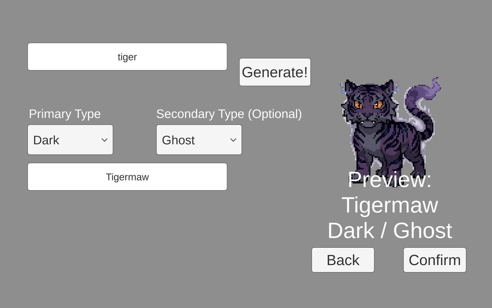
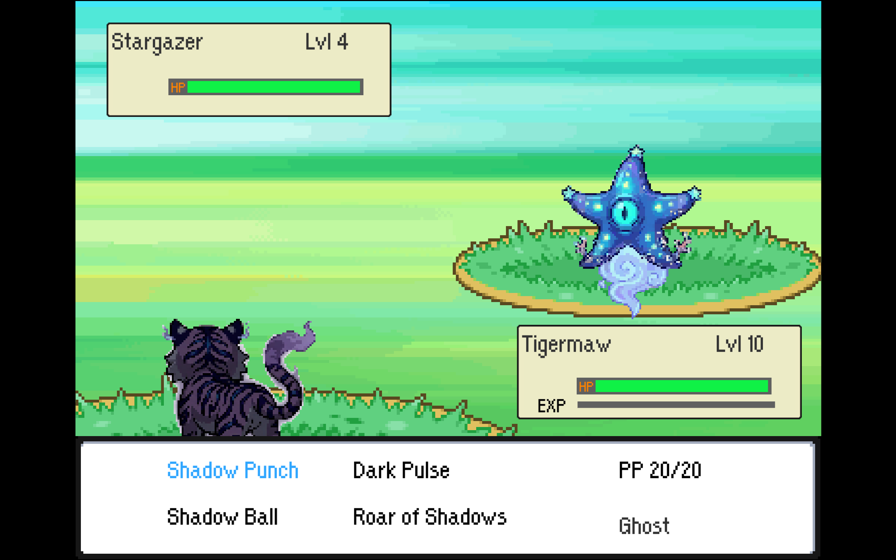

# Pokerot

Pokerot is a small Unity monster-battling game inspired by classic Pokemon. The main twist is that the player can create a custom starter Pokemon from an animal or idea, then use it in a turn-based battle loop.

The game uses AI to help generate the custom Pokemon's name, typing, moves, description, and front/back pixel-style sprites. This is a learning project and prototype, not a commercial Pokemon game.

## Preview







## What You Can Do

- Create a custom starter Pokemon from a text idea.
- Pick one or two types yourself, or let the AI choose.
- Generate front and back pixel-style battle sprites.
- Battle with your custom Pokemon in a simple turn-based battle system.
- Encounter normal Pokemon and previously generated custom Pokemon as wild battles.
- Catch wild Pokemon and add them to your party.

## Tech Notes

The project is built in Unity `6000.0.34f1`.

Main systems:

- `Assets/Scripts/UI/PokemonCustomizationUI.cs` handles the custom Pokemon creation flow.
- `Assets/Scripts/Data/ImageGenerator.cs` calls Poe for image generation and processes the returned sprites.
- `Assets/Scripts/ChatGPT/` contains both OpenAI-compatible chat support and a local Ollama option.
- `Assets/Scripts/Battle/BattleSystem.cs` runs the turn-based battle logic.
- `Assets/Scripts/Pokemon/PokemonDatabase.cs` loads Pokemon data from local assets or PokeAPI.
- `Assets/Scripts/Overworld/WildPokemonSettings.cs` controls wild Pokemon encounter weights.
- `Assets/Resources/AIPromptConfig.json` stores the editable AI prompts.

## Running It


For a built Windows game, keep the whole build folder together and run `Pokerot.exe`. Do not move only the exe, because Unity also needs the `_Data` folder and DLLs beside it.

## AI Setup

The AI sprite generation needs a Poe API key. For a built Windows game, put a file named `LocalApiSecrets.json` in the same folder as `Pokerot.exe`:

```text
Pokerot.exe
LocalApiSecrets.json
Pokerot_Data/
UnityPlayer.dll
```

The file should look like this:

```json
{
    "poeApiKey": "your-poe-key",
    "openAIApiKey": ""
}
```

For Unity Editor testing, put the same `LocalApiSecrets.json` file in the project root. `LocalApiSecrets.example.json` is included as a safe template.

`openAIApiKey` is only needed if you switch from the local Ollama text model to the backup OpenAI chat path.

## Controls

- Arrow keys: move/select
- `Z` or Space: confirm
- `X` or Backspace: cancel/back
- In battle, the Bag option currently throws a Pokeball

## Current State

This is still a prototype. The core loop works: generate a Pokemon, save it locally, battle with it, encounter custom Pokemon later, and catch wild Pokemon. Some generated content can be weird because it depends on the AI response, but the game has fallback handling for failed sprite generation and incomplete move data.

Generated custom Pokemon, sprites, and moves are saved locally under `Assets/Resources/CustomPokemon`, `Assets/Resources/CustomSprites`, and `Assets/Resources/CustomMoves` while working in the editor.

## Credits

This project builds on [WaterHusky's Pokemon Game Project](https://github.com/WaterHusky/LeBryan_P03A), which provided the base Pokemon-style battle system. I extended it with AI Pokemon creation, custom sprite generation, runtime persistence, and extra tooling around generated content.
